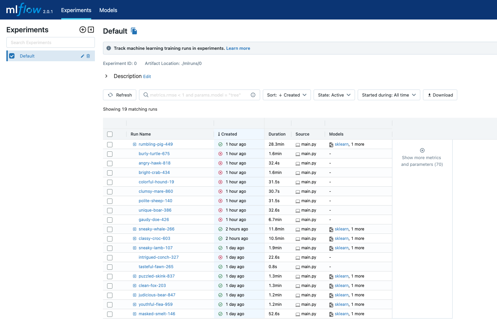
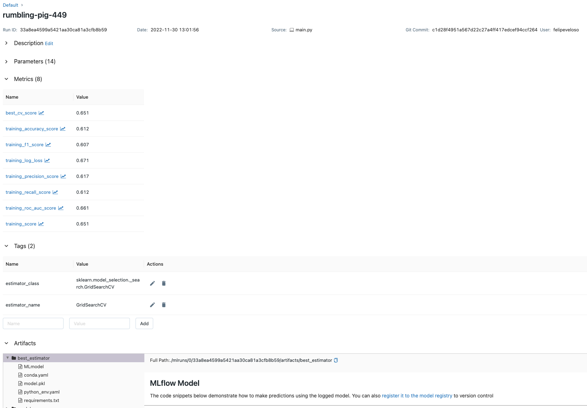
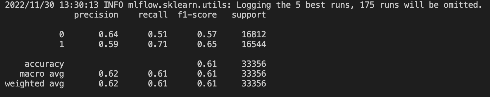

# Flight Prediction MLE TEST

## Descripcion

Para asegurar una separacion de ambientes tener presente la utilizacion de virtual env

```bash
create virtual env
python3 -m venv mle
source mle/bin/activate
pip3 install -r requirements.txt
```

---

## Pregunta 1


Al desconocer el objetivo de las areas de negocios se decidirá arbitrariamente el objetivo de negocio. el cual es será maximizar la precision en las predicciones de atrasos y aceptar algunos errores en la prediccion para casos de atraso como no atrasos. El modelo obtenido con la tecnica xgboost y sus metricas con hiperparametriacion, serían las mejores metricas obtenidas en base a la experimentacion del modelo.
ahora hay que considerar que le modelo tiene un desbalance de clases alto pese al haber utilizado algunas tecnicas de upsampling. en metricas este modelo es el que posee mas "equilibrio" al momento de entregar respuestas a la condicion de atrasos o no atrasos

* aspectos claves
el modelo por si solo toma la informacion desde la salida y no tiene inputs para el momento de llegada, en sí no se manejan dispositivos IOT que ayuden a mejorar las predicciones en medio dle vuelo

* evaluacion de feature engineering

quiza una de las mayores debilidades del modelo al manejar las fechas, es la falta de la utilizacion de UTC el cual podriamos inferir respecto al pais y hacer un cruce de informacion según las fechas, podriamos cuadrar esto con alguna API de confianza, así funciones como "diferencia de tiempo" o tiempos de vuelo será real y no tendremos los falsos tiempos en nuestros features

Otro problema visible en los features es el sesgo de los casos positivos/negativos (55592/12614)
por lo tanto estrategias de upsampling basicas no seán una gran ayuda, solo aumentar margenes de error

# Pregunta 2

Para la mejora del modelo, se realizaron algunas hyperparametrizaciones con la base de un algoritmo xgboost, realmente las metricas no fueron mejoradas de sobre manera, pero si se buscó de manera intensa la forma de generar un modelo que lograra equilibrar el fitting del modelo a la vez solucionar el problema del upsampling para mejorar en parte las metricas.





# Pregunta 3

api + github/workflow

Se generá una API basica para consumo de modelos, considerando el uso de un modelo mas bien primitivo, se enviará mediante variable de ambiente la ubicacion del modelo, por otro lado se han añadido las instrucciones basicas de github workflows para hacer un despliegue en alguna nube objetivo (no se configuró el token dado que no se podrá verificar en la nube objetivo)

[API](api/README.md)

# Pregunta 4
Los test de estress pueden ser revisados desde el link abajo

[TEST](test/README.md)

# Pregunta 5

Claramente el performance en ambientes locales presentó un limite en la escalabilidad de recursos, la solucion inicial es claramente trabajar en ambientes cloud, administracion de cluster de crecimiento tipo k8s o cluster de spark distribuidos para entrega de servicios (poco practico, pero es una opcion).
Añadir una GPU o TPU (en caso de utilizar tensorflow) añadiría gran nivel de respuesta al momento de encontrar respuestas del modelo.
A nivel de software, solo se pueden considerar pequeños arreglos dado que el servicio en si, ya es una expresion minima de como servir un modelo sin considerar validaciones, seguridad, autenticacion entre otros factores del software en si.


