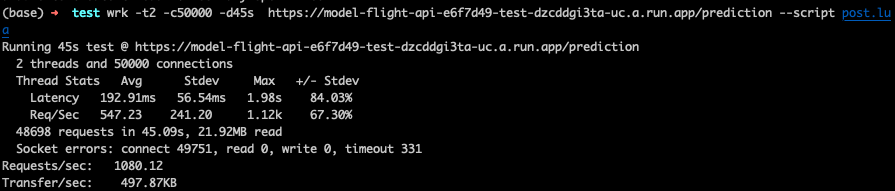
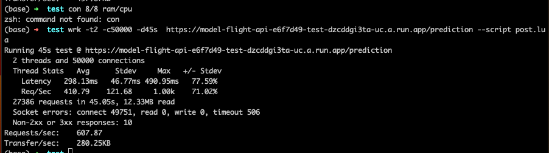

# flight delay prediction API TEST

## Stress Test

Ejecucion de test, se añadío el script de POST para obtener metricas en base a los resultados del modelo considerando la carga de respuesta.
La recomendacion inicial para esto es deplegar en algún sistema que permita la disponibilizacion de recursos de manera dinamica (HPA) y con el 
apoyo de alguna GPU para facilitar computos

se generarón 2 instancias de pruebas, la cuales denotan diversos resultados al realizar ajustes a los recursos en la infraestructura de despliege (cloud run)

