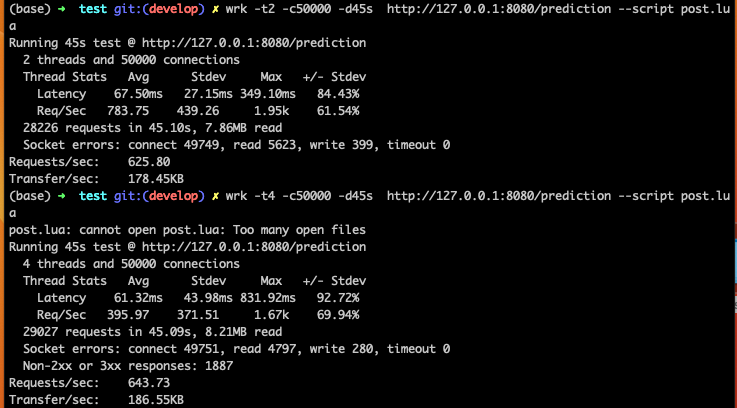

# MLE TEST

## Stress Test

Ejecucion de test, se añadío el script de POST para obtener metricas en base a los resultados del modelo considerando la carga de respuesta.
La recomendacion inicial para esto es deplegar en algún sistema que permita la disponibilizacion de recursos de manera dinamica (HPA) y con el 
apoyo de alguna GPU para facilitar computos.

Las pruebas en esta instancia fueron creadas en una version local, la cual no permitió ajustar recursos de manera dinamica como si fueran recursos cloud
Adicional se añadieron pruebas en instancias cloud run pero el despliege y utilizacion de esta misma se escapa del test.
se generarón 2 instancias de pruebas, la cuales denotan diversos resultados al realizar ajustes a los recursos en la infraestructura de despliege (cloud run).

